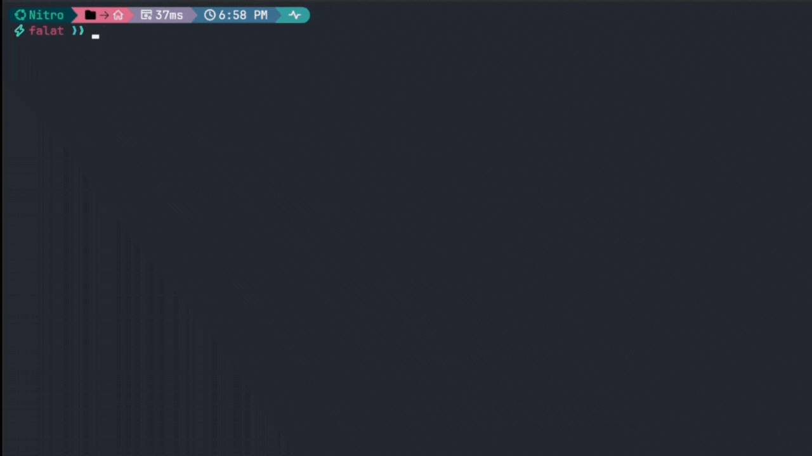

## Hey 👋, I'm Fernando!

<div align='center'>
<a href="https://github.com/falatfernando" target="_blank"> 

</a>
<a href="https://linkedin.com/in/fernandofalat" target="_blank">

</a>
</div>

### Welcome to my profile! 👻
Master's degree student and bioinformatician @ <a href = 'https://www5.usp.br/'>USP</a>, Data Science and Analytics MBA and a Bioprocess and Biotechnology Engineer with a deep passion for bioinformatics. 

On a continuous learning journey to discover the secrets of genomics. 🧬

---

## Languages and Tools 🛠️
<div align="center">  
 

 
 
 

 
  
  
</div>  



```shell
$ bash falatfernando.sh
```


