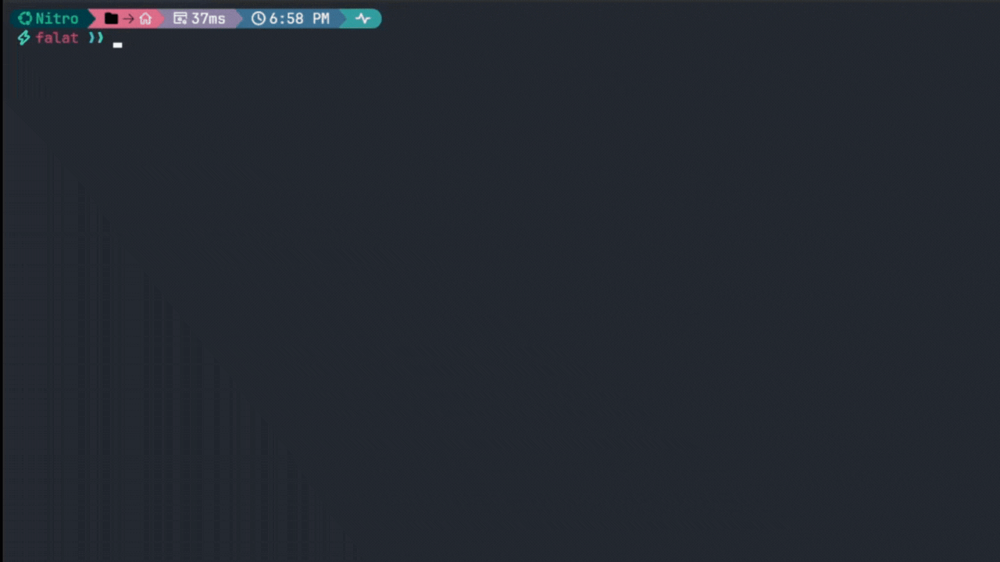

# Fernando Falat

<p align="center">
  
</p>

<p align="center">
  <a href="https://github.com/falatfernando">
    
  </a>
  <a href="https://linkedin.com/in/fernandofalat">
    
  </a>
</p>

## About Me

Master's degree student and bioinformatician at [USP](https://www5.usp.br/), MBA in Data Science and Analytics and in Bioprocess and Biotechnology Engineer.

I focus on extracting biological insight from complex datasets and building practical analytics workflows for genomics.

## Core Stack

<p align="left">
  
  
  
  
  
  
  
</p>



```shell
$ bash falatfernando.sh
```
